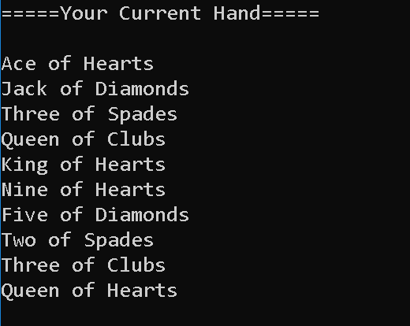
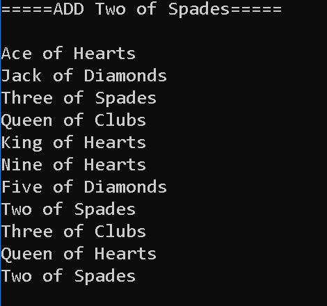
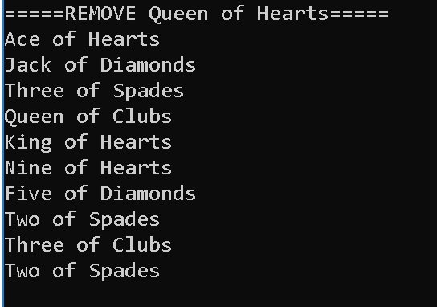
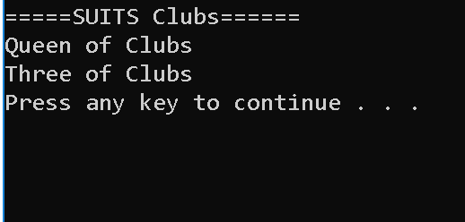

### Lab07 Collections

Create a custom generic collection named Deck<T>. This collection with old Cards. Create a Card class that utilizes n enum to hold the card suits and values. Then create methods in the Deck class to add, remove, and return the suit of cards.

## Load Application
1.	in terminal: git clone https://github.com/mtncrawler/lab07-collections.git
2.	open lab07-collections.sln file
3.  run project without debugging

